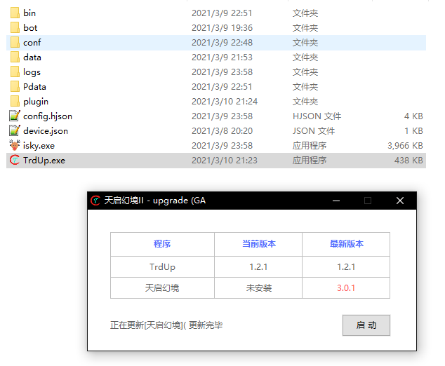
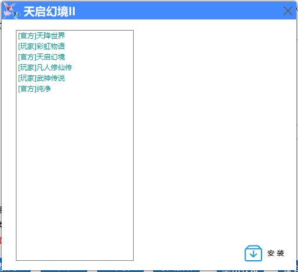
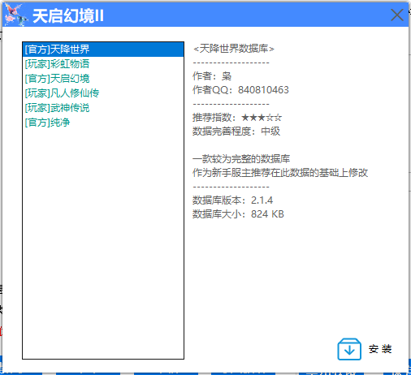
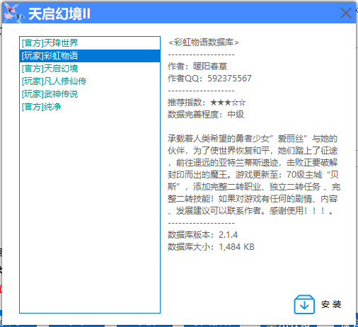
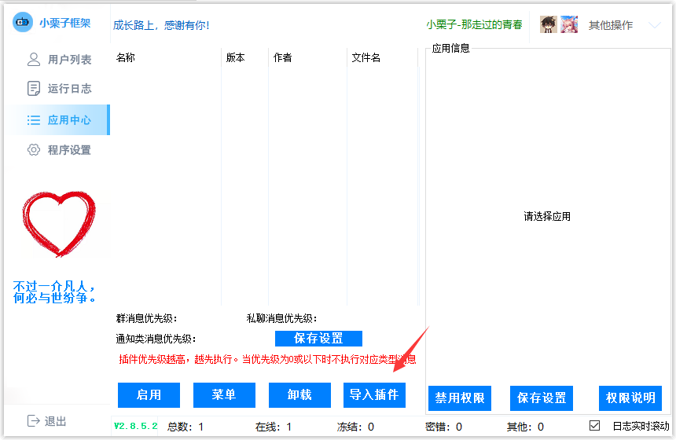
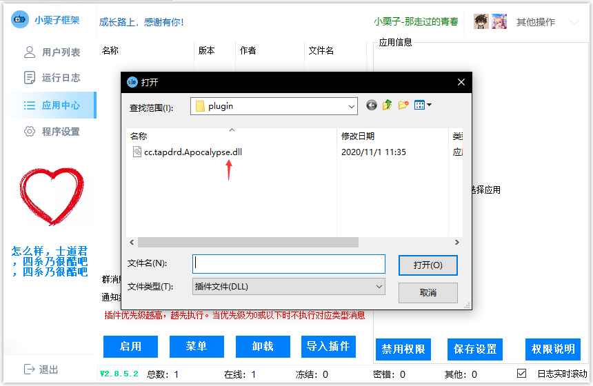

## 1. 下载机器人框架

目前支持以下机器人平台

* OnO<Badge text="可用"/>

* NanBot<Badge text="可用"/>

* Lemon<Badge text="可用"/>

* 小栗子<Badge text="可用"/>

* QQMini<Badge text="可用"/>

* ISky<Badge text="可用"/>

<!-- * CQ<Badge text="停止维护" type="warning"/>

* QQLight<Badge text="停止维护" type="warning"/>

* 先驱<Badge text="停止维护" type="warning"/>

* Cat<Badge text="停止维护" type="warning"/> -->

## 2. 下载Trdup

`Trdup` 是天启幻境的插件更新器

#### 下载方式：

1. 框架社区
2. [交流群](https://jq.qq.com/?_wv=1027&k=uEz7FvmT)(群文件下载)
3. [蓝奏云](https://www.lanzoux.com/b01nmqkwf)(云盘下载)

## 3. 运行Trdup

下面以 `ISky` 平台为例

将`Trdup` 与机器人程序放在一起

双击 `Trdup` 运行

提示 `更新完毕` 点击启动

## 4. 登陆机器人QQ

启用框架完毕后, 登陆机器人QQ

小栗子框架如果不显示插件,需要[手动导入](#小栗子需手动导入)

## 5. 启用插件
::: warning 提示
先登录账号

再启用插件

如果进行上述操作不行后, 重启框架即可解决
:::
第一次启用插件会弹出以下画面

<Badge text="NanBot平台不会出现该画面" type="warning"/>

## 6. 选择数据库

点击列表可查看数据具体信息

请选择合适的数据库安装

<Badge text="NanBot默认安装天降世界数据" type="warning"/>

## 7. 安装完成

插件已启用,安装完毕数据库, 接下来可以进行设置/游戏

## 小栗子需手动导入

1. 点击导入插件
2. 选择`cc.tapdrd.apocalypse`
3. 导入成功,启用插件

