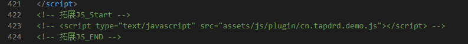
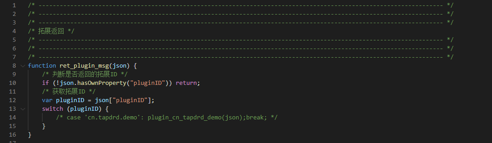

## 规范
Ver: 1.0.0

## 发送规范
拓展与网页是通过json传递

通过网页发送的json, 请遵循内容均放在 `info` 节点下面

例如
~~~json
"info":{
    "a":"b",
    "msg": "发送命令",
    "num": 1
}
~~~

## HTML规范
以下以默认模板为例

如果是其他模板, 请遵循其他模板的规范

###  JavaScript

### `命名`
每一个拓展的json名,请尽量以appid来命名

例如: cn.tapdrd.demo.js
### `位置`

拓展js的位置请放在,里面
~~~
    网页\assets\js\plugin
~~~
### `处理`

拓展js里面,请按照规范命令函数名

处理函数请命名为 `这个与下面的引入规范有关系`
~~~
    plugin_{APPID}
    例如
    plugin_cn_tapdrd_demo
~~~
其他函数也请尽量以APPID命名
~~~
    cn_tapdrd_demo_xxxx
    例如
    cn_tapdrd_demo_setMsg
    cn_tapdrd_demo_getMsg
~~~

## 引用规范

###  game.html

在`game.html`要进入拓展js文件

在文件的尾部,这个位置 , 请添加你拓展所需的JS

### games.js

在`games.js`内, 拓展需要处理自己返回的json

请添加
~~~JavaScript
    case 'cn.tapdrd.demo': plugin_cn_tapdrd_demo(json);break;
    case 'cn.tapdrd.demo2': plugin_cn_tapdrd_demo2(json);break;
    case 'cn.tapdrd.demo3': plugin_cn_tapdrd_demo3(json);break;
~~~