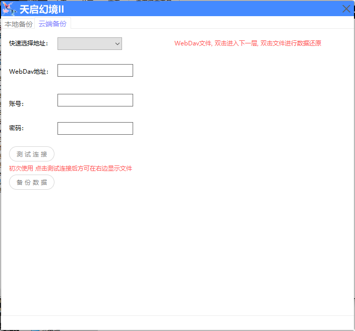
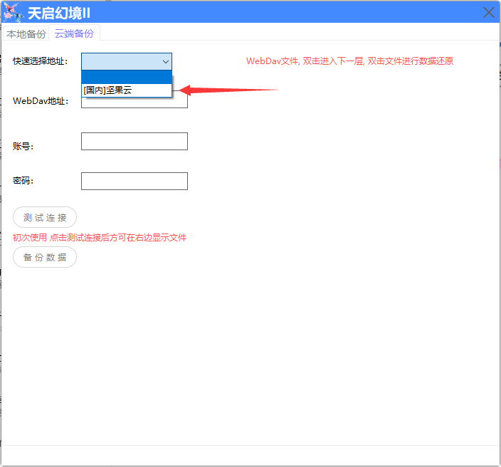
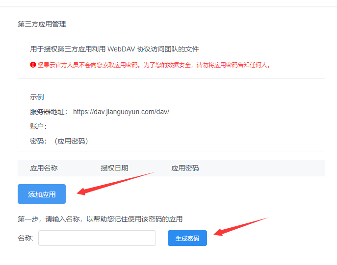

## 不回复消息

::: info 发送命令但是机器人没反应
 1.  插件未开启
 2.  游戏未开启(进入控制台开启游戏
 3.  群限制(进入控制台进行群可用设置
 4.  开启了命令前缀, 这样命令就是  前缀+命令
 5.  命令不正确 (请核查命令是否正确
 6.  屏蔽了, 日志有显示群里没有 (此情况只能等待
 7.  被其他插件或者拓展拦截了  (联系相关开发者
:::

## 重新选择数据

::: info 操作步骤
 1. 关闭机器人
 2. 进入插件[数据目录](/index/#数据目录)
 3. 删除 `game.db` 和 `config.db` 两个文件
 4. 重启机器人, 即可重新选择数据
:::

## 一直初始化中

::: info 以下可能
 1. 未登陆账号 (如已登录请重启框架)
 2. 未选择数据库 (第一次使用插件, 需要选择数据)
 3. 查看日志, 可能是其他操作导致 (组件未正常创建 / 插件需要更新等)
:::

::: info 方法2
 1. 群文件内下载 `初始化失败修复工具`

 2. 将工具与 `机器人` 放在同一目录下
 3. 运行 `初始化失败修复工具`

:::

## 初始化失败

::: info 方法1
 1. 退出机器人 (打开任务管理结束机器人进程)
 2. 重启机器人
:::

::: info 方法2
 1. 群文件内下载 `初始化失败修复工具`

 2. 将工具与 `机器人` 放在同一目录下
 3. 运行 `初始化失败修复工具`

:::

## Trdup更新相关

::: info 获取失败
 1. 程序未联网/或被禁止联网
 2. 未正确解析到服务器, 请尝试清除DNS
:::

::: info 未安装插件
  提示未安装插件, 但是没进行插件下载

  原因：未将Trdup与框架放在一起
:::

::: info 文件被占用
  未关闭框架
  
  (可能关闭了但是进程依然存在, 请打开任务管理器结束进程)
:::

::: info 下载失败
 1. 程序未联网/或被禁止联网
 2. 未正确解析到服务器, 请尝试清除DNS
 3. 程序没有写入权限, C盘请使用管理员权限运行
 4. 被杀毒软件限制, 请添加至信任
:::

## 云端备份

::: info 使用
  收费版才可以使用此功能
:::

::: info WebDav
  支持WebDav的网盘才可以使用此功能
  目前国内支持的网盘
  1. 坚果云
:::

::: info 填写数据
  下面以坚果云为例
:::

### 1. 快速选择地址
也可以手动将`https://dav.jianguoyun.com/dav/` 填入WebDav地址内
 

### 2. 填写账号
 
### 3. 填写密码
密码并非坚果云账号的登录密码

需要进入`https://www.jianguoyun.com/#/safety` 

添加应用, 后续生成的密码才是控制台填写的密码
 

### 4. 测试连接
配置完毕后点击测试连接, 如果成功 即可正常云备份