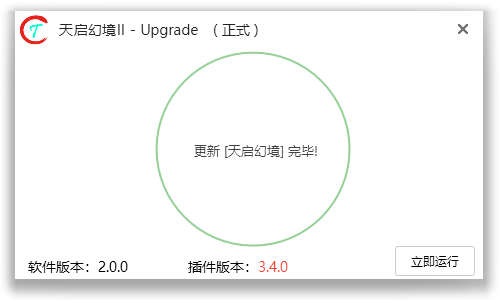
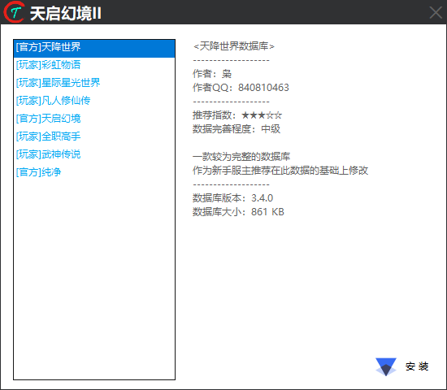

## Trdup

::: info 下载
`Trdup.exe`程序是天启幻境的自动更新器

[交流群](https://jq.qq.com/?_wv=1027&k=uEz7FvmT)(群文件下载)  
[蓝奏云](https://trd.lanzn.com/b01nmqkwf)(云盘下载)
:::
## 安装位置

将`Trdup` 与 `框架程序` 放在同一目录下

## 运行Up

鼠标双击 `Trdup`  运行更新器以下载稳定版天启

::: tip
更新完毕后点击右下角的 __立即运行__ 启动
:::

## 选择数据

第一次登陆以后会出现一个数据选择界面
::: warning
新手不建议选择 __纯净__ 或者其他 __数据完善低__ 的数据
建议有过其他同类游戏的开服经验或者已经熟悉了天启框架的人可以选择 __纯净__ 创造一个自己的游戏世界
:::
