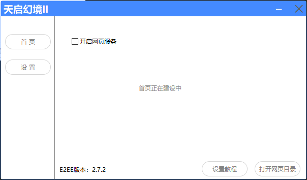

基于E2EE 前端/后端, 前端可自行选择关闭,自己搭建前端

天启幻境II Web功能是可以让玩家脱离客户端, 在网页上游玩的功能

::: warning
建议有被外网访问的权限再使用此功能, 如果无权限, 仅自己电脑网页游玩, 无法与其他人一起  
需要注意非专业版, 有外网访问权限也只能游戏主人登陆体验, 专业版可正常使用
:::

## 演示

## 浏览器支持

:::: center
低于下面浏览器版本可能无法正常登录
::::
| Edge ≥ 79| Firefox ≥ 78  | Chrome ≥ 64| Safari ≥ 12 |
|  ----  | ----  | ----  | ----  |

## 1. 进入控制台

## 2. 勾选网页服务

## 3. 进行设置

图中外网IP 请填写自己服务器的外网IP

外网    例如：180.xxx.xxx.11
域名    例如：d.tapdrd.cn

注：非服务器/家用 无法直接通过外网IP访问

## 4. 本地测试

设置完毕后, 可以点击本地测试

将弹出到浏览器, 此时浏览器的网址应该是

127.0.0.1: 你设置的端口号, 80端口默认是不会显示端口号的

注1:需要服务器开放 网页端口 和 websocket 端口  
注2:需要[浏览器支持](#环境支持)  
否则会出现连接服务器失败的提示

## 5. 外网测试

可以打开的你的手机浏览器

直接访问： IP: 端口, 即可访问

注：也可以用域名解析IP, 之后即可用域名访问

## 关于登陆

登陆的账号是QQ号

密码需要私聊机器人单独设置

默认指令: 设置密码

例如私聊机器人：设置密码123456
