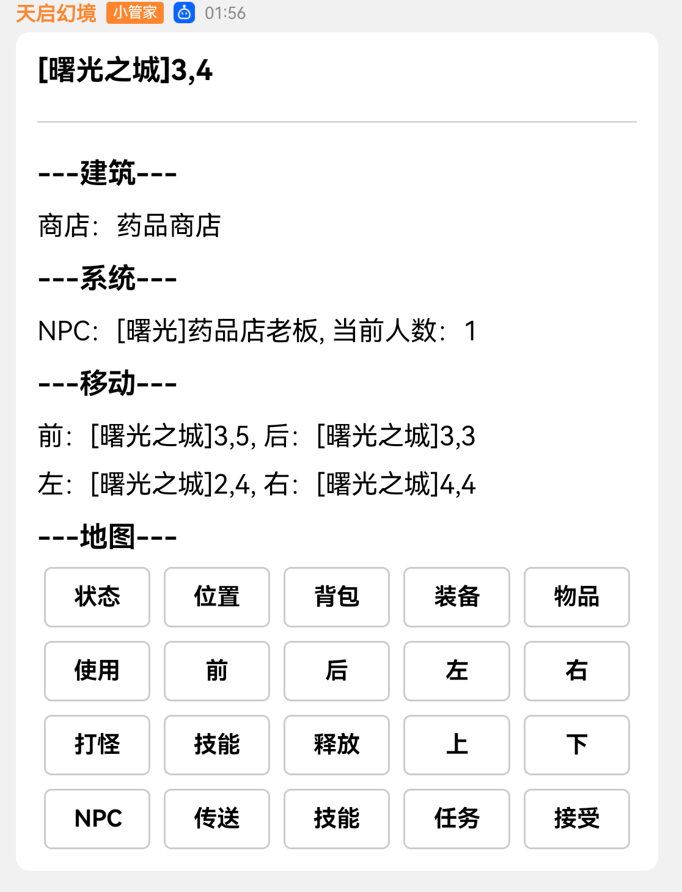

::: warning
高级功能, 建议有开发经验或者已经熟悉天启框架和BOT开放平台的用户使用此功能
:::
## 说明
通过Markdown,可在发送类似下列的消息  

## 格式
::: info
请把Markdown放置在正常文本内容的下面
:::
### 头部格式
~~~INI
    {正常内容}
    -----[Markdown]-----    // 开始标记
    [Markdown:head,ver=1]   // Markdown版本,目前只有1
    [Markdown:head,id=]     // Markdown模版ID
    [Markdown:head,keyID=]  // 按钮模版ID
    [Markdown:head,msg=]    // 允许回复的消息类型 1频道私信,2频道消息,3群聊,4单聊, 多个用|分割
    [Markdown:head,msgR=]  // 主动回复还是被动回复, 填写on为主动回复, 因为被动回复需要申请权限
    -----[End]-----     // 尾部
~~~
## 消息格式
~~~INI
    {头部格式}
    [Markdown:info,key=]    // 对应模版key
    // [必填]value, 对应内容
    [/Markdown]
    // 在[Markdown:info]的结尾需要填上, 需要注意不允许换行, 如果换行会被自动替换
~~~

### 示例
假设你的Markdown模版里key有 `title` 和 `content`
~~~INI:line-numbers
    [系统提示]
    你已经注册了账号!
    -----[Markdown]-----
    [Markdown:head,ver=1]
    [Markdown:head,id={id}] // 模板ID
    [Markdown:head,msg=2] // 仅允许频道消息时发送Markdown消息
    [Markdown:head,msgR=on] // 主动回复
    -----[End]-----     // 尾部
    [Markdown:info,key=title]系统提示[/Markdown]
    [Markdown:info,key=content]你已经注册了账号![/Markdown]
~~~