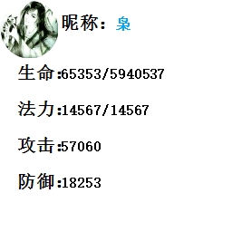

## 自定义绘制

本章可以帮助你学会如何使用`自定义图片绘制`

图片绘制为一行一个, 请勿并行绘制

### v1

对于v1, 的格式说明

图片自定义绘制由两部分组成
~~~
1. 绘制头部
2. 绘制内容
~~~~
当前其实还有第0部分
~~~
0. 注释
~~~
### 1. 绘制头部
~~~INI
-----[Draw]-----        // 头部
[Draw:head,ver=1]        // 自定义绘制版本, 目前只有1
[Draw:head,bd=]         // 绘制背景, 不填写则为默认, 无默认则为白色背景
[Draw:head,x=]          // 图片宽度, 不填则以背景图片大小为准
[Draw:head,y=]          // 图片高度, 不填则以背景图片大小为准
[Draw:head,fontn=]      // 绘制默认字体名称
[Draw:head,fonts=]      // 绘制默认字体大小
[Draw:head,gif=on]      // 此绘制为GIF, 不填写则为png图片
-----[End]-----     // 尾部
~~~
### 2. 绘制内容
~~~INI
[Draw:info]
// [必填]x起始左边,y起始顶边
// [选填]recx 矩形宽度, recy 矩形高度
// [选填]fontn 字体名称, fonts 字体大小
// [选填]color 字体颜色(十六进制)
// [选填]clear 字体透明度, 0-255, 默认为255
// [选填]style 0普通 1加粗 2倾斜 3加粗倾斜 4下划线 8删除线
// [选填]Lalign行对齐 0靠近,1居中,2远离
// [选填]align 文本对齐 0靠近,1居中,2远离
// [选择]Mvertical 文本格式 0无效 1垂直
[/Draw]
// 在[Draw:info]的结尾需要填上

/[Draw:image]
// [必填]x起始左边,y起始顶边
// [选填]recx 强制大小x, recy 强制大小y
// [选填]type 1为圆图片
// [选填]center true居中
// [必填一个]file 与图片码一致
// [必填一个]url  文件网址
~~~
### 0. 注释
~~~
在绘制的一些地方可以使用注释, 防止以后自己忘了
如果不清楚哪些地方可以放注释, 可以看下面的例子
~~~
### 一个示例
这是一个最简单的示例, 你只需要复制后把他放在词库内即可运行
~~~INI:line-numbers
// 这里是可以放置注释
// 该绘制是一个示例
[Apo:draw] // 开启部分绘制功能后, 需要用此变量才能绘制图片
-----[Draw]-----
[Draw:head,ver=1]
[Draw:head,x=256]
[Draw:head,y=256]
[Draw:head,fontn=宋体]
[Draw:head,fonts=16]
-----[End]-----
// 在0,0的位置 生成一个 64*64 的用户 圆头像
[Draw:image,x=0,y=0,type=1,recx=64,recy=64,url=<Apo:avatar,type=user,msg=<Apo:qq,type=attr,msg=用户>>]
// 昵称显示
[Draw:info,x=64,y=15,fonts=20,style=1]昵称：[/Draw]
[Draw:info,x=125,y=18,color=#03A9F4]<Apo:qq,type=attr,msg=昵称>[/Draw]
// 用户属性展示
[Draw:info,x=16,y=70,fonts=20,style=1]生命：[/Draw]
[Draw:info,x=16,y=110,fonts=20,style=1]法力：[/Draw]
[Draw:info,x=16,y=150,fonts=20,style=1]攻击：[/Draw]
[Draw:info,x=16,y=190,fonts=20,style=1]防御：[/Draw]
[Draw:info,x=64,y=73]<Apo:qq,type=attr,msg=生命>/<Apo:qq,type=attr,msg=生命上限>[/Draw]
[Draw:info,x=64,y=113]<Apo:qq,type=attr,msg=法力>/<Apo:qq,type=attr,msg=法力上限>[/Draw]
[Draw:info,x=64,y=153]<Apo:qq,type=attr,msg=攻击>[/Draw]
[Draw:info,x=64,y=193]<Apo:qq,type=attr,msg=防御>[/Draw]
~~~
效果展示

